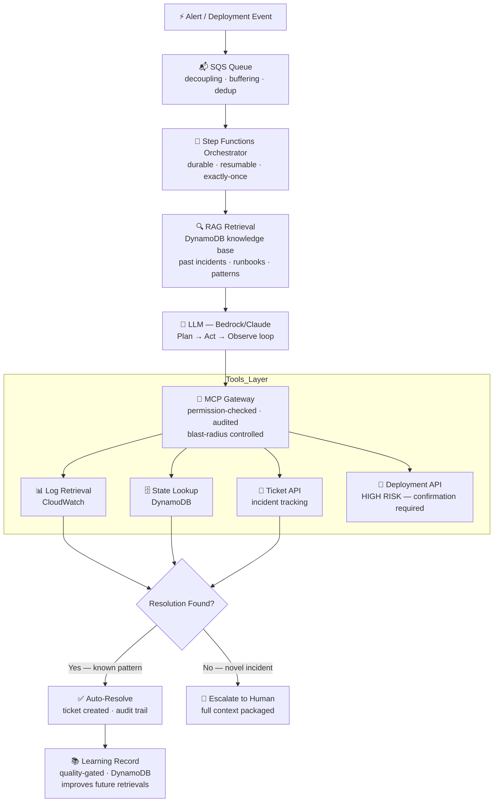
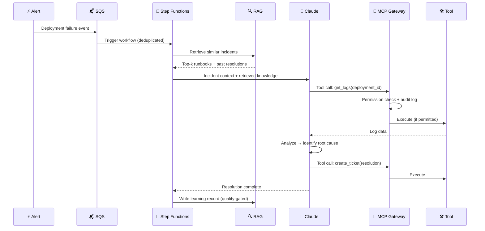

# agentic-ops


> I built a production AI agent that eliminated 95% of manual oncall triage on a CI/CD and migration platform serving **25,000+ internal teams** and **500,000+ end customers**. The same platform handles a large-scale BI migration processing millions of dashboard assets. Here's every architecture decision, tradeoff, and lesson learned.

---

## The Problem

The platform this agent runs on serves **25,000+ internal teams** — each supporting 15–20 end customers — reaching **500,000+ end customers** whose experience depends directly on deployment reliability. On top of ongoing production deployments, the platform also owns a large-scale BI migration processing **millions of dashboard assets**.

Running oncall at this scale means **30–40 deployment failure tickets per week** — each requiring the same investigation cycle:

1. Deployment fails → alert fires (could be routine CI/CD or migration pipeline)
2. Engineer wakes up, correlates logs across 4-5 systems
3. Finds the known failure pattern across a 9-step deployment pipeline — 25+ distinct failure signatures mapped to root causes
4. Applies the fix
5. Documents it in a ticket
6. Goes back to sleep

**None of that required human judgment.** It required access to systems, pattern recognition, and execution of a known remediation — at a platform that never sleeps because it serves hundreds of thousands of customers across time zones.

The goal: build an agent that handles the full triage loop autonomously — from alert to resolution — while maintaining complete auditability and safe fallback to human escalation. The platform this runs on spans **3 production environments**, is built on **19 CDK stacks** with **7-stage Step Functions orchestration**, and maintains **99.8% availability** across all supported workloads.

---

## The Problem → Solution → Impact

| | |
|---|---|
| **Problem** | Oncall for a platform serving 500,000+ end customers and processing millions of migration assets means the same triage loop — alert → logs → pattern → fix → document — repeated dozens of times a week. Every hour of delayed triage is an hour of degraded experience for downstream customers. |
| **Solution** | An agentic AI system that handles the full triage loop autonomously: governed tool access via MCP, durable execution via Step Functions, knowledge retrieval via RAG, and safe escalation when genuinely novel. |
| **Impact** | 75%+ adoption, 95% reduction in manual triage time, zero production incidents caused by the agent. 200+ incidents processed, 25+ distinct patterns classified, 90% reduction in weekly oncall triage hours — protecting SLAs for 500,000+ end customers. |

---

## System Design



---

## Data Flow



---

## Layer Breakdown

| Layer | Technology | Problem It Solves |
|-------|-----------|------------------|
| **Event Ingestion** | SQS | Decouples alert producers from triage. Buffers alert storms. Deduplicates related failures. |
| **Orchestration** | Step Functions | Durable execution survives Lambda restarts. Built-in retry, state history, dead-letter queues. |
| **Intelligence** | Bedrock (Claude) | Plan→Act→Observe loop. Reasons across tool outputs to identify root cause. |
| **Tool Access** | MCP Gateway | Every tool call permission-checked, blast-radius controlled, and audit-logged before execution. |
| **Knowledge** | DynamoDB + embeddings | Sub-ms retrieval of past incidents and runbooks. Self-improving via quality-gated learning records. |
| **Compute** | Lambda | Serverless — scales to zero, per-invocation billing, no idle capacity cost. |
| **Infrastructure** | CDK (TypeScript) | Type-safe IaC. Version-controlled infrastructure. Multi-environment promotion with rollback gates. |
| **Observability** | CloudWatch | Resolution rate SLO, false positive rate, tool permission denial rate, MTTR delta. |

---

## The Architecture

```
Alert / Deployment Event
         │
         ▼
┌────────────────────────────────────────────────────────┐
│                    Agentic Ops Platform                │
│                                                        │
│  ┌──────────────────────────────────────────────────┐  │
│  │              Orchestration Layer                 │  │
│  │   Step Functions state machine — durable,        │  │
│  │   resumable, exactly-once execution              │  │
│  └──────────────────┬───────────────────────────────┘  │
│                     │                                  │
│  ┌──────────────────▼───────────────────────────────┐  │
│  │              MCP Gateway                         │  │
│  │   Governed tool access — every tool call         │  │
│  │   permission-checked, logged, blast-radius       │  │
│  │   controlled                                     │  │
│  └──────────────────┬───────────────────────────────┘  │
│                     │                                  │
│  ┌──────────────────▼───────────────────────────────┐  │
│  │                 LLM (Bedrock/Claude)              │  │
│  │   Plan → Act → Observe loop                      │  │
│  │   Tools: log retrieval, state lookup,            │  │
│  │           ticket creation, deployment API        │  │
│  └──────────────────┬───────────────────────────────┘  │
│                     │                                  │
│  ┌──────────────────▼───────────────────────────────┐  │
│  │              Knowledge Base (RAG)                │  │
│  │   DynamoDB — past incidents, resolution          │  │
│  │   patterns, runbook embeddings                   │  │
│  └──────────────────────────────────────────────────┘  │
└────────────────────────────────────────────────────────┘
         │
         ▼
    Resolved ✓  OR  Escalate to human (with full context)
```

---

## Two Operating Modes

A production agentic ops platform runs in two distinct modes with different requirements:

### Mode 1: Batch Triage (throughput-focused)
Process a queue of N incidents in sequence. Same SOP applied repeatedly. Speed matters — target < 2 minutes per incident.

```
Queue of incidents → SOP routing → classify → draft → approve → post → next
```

Key design choices for batch mode:
- Smaller, faster model for pattern matching (most incidents fit known patterns)
- Pre-loaded knowledge base context (don't re-fetch runbooks per incident)
- Structured output format (consistent RCA templates, not free-form)
- Batch confirmation: human reviews the entire batch before any posts

### Mode 2: Deep Investigation (quality-focused)
Single complex incident that doesn't match known patterns. Spend time, not speed.

```
Single incident → extended context → multi-tool investigation → root cause → escalate or resolve
```

Key design choices for deep mode:
- Larger model with longer context window
- Live tool calls (CloudWatch, DynamoDB, deployment history)
- Reasoning trace preserved for human review
- No time pressure — accuracy over latency

**Why this distinction matters in architecture:** If you build one system for both modes, you optimize for neither. Batch mode needs fast, cheap, consistent. Deep investigation needs thorough, flexible, expensive. Separating them by workflow type lets you route to the right configuration automatically.

---

## Every Architecture Decision

### 1. Step Functions for orchestration — not a custom loop

**What I chose:** AWS Step Functions as the workflow backbone.

**Why not a simple `while` loop in Lambda:**
Lambda has a 15-minute execution limit. A triage workflow can take longer — especially if it's waiting for a deployment to complete or retry. Step Functions gives you:
- Durable execution (survives Lambda restarts)
- Built-in retry with exponential backoff
- Dead letter queues for failed workflows
- Complete execution history for every run
- Zero code for state persistence — the state machine handles it

The equivalent in non-AWS world is **Temporal** — same concept, different vendor. The key insight: your orchestration layer must survive failures independently of your business logic.

**Tradeoff:** Step Functions has a per-state-transition cost. For high-frequency workflows, evaluate Temporal or Prefect. At our scale, Step Functions was the right call.

---

### 2. MCP for tool access — not direct API calls

**What I chose:** Model Context Protocol (MCP) as the interface between the LLM and every external tool.

**Why not just let the LLM call APIs directly:**
Direct API access from an LLM is how you get production incidents caused by the agent. MCP adds a governed access layer:

```
Without MCP:                    With MCP:
LLM → CloudWatch API            LLM → MCP Gateway → permission check
LLM → DynamoDB write               → audit log
LLM → deployment API               → blast-radius guard
                                   → CloudWatch API (if permitted)
```

Every tool is registered with:
- Required permissions (agent must hold them to call)
- Risk level (LOW / MEDIUM / HIGH)
- Confirmation requirement for HIGH risk operations (e.g. rollbacks)

The agent cannot call a tool it isn't authorized for. Period. Every call — permitted or denied — is written to an immutable audit trail.

**Key insight:** Don't give agents the keys to the kingdom. Define the minimal set of tools they need for each workflow and enforce it at the infrastructure layer, not in the prompt.

---

### 3. DynamoDB for state and knowledge — not a vector DB

**What I chose:** DynamoDB for both operational state and the knowledge base.

**Why not a dedicated vector database:**
For our use case, the knowledge base was structured: incident patterns, resolution steps, runbook sections. Semantic search was useful but not the primary retrieval mechanism.

DynamoDB gave us:
- Sub-millisecond reads for pattern lookup by incident type
- TTL-based expiration for stale runbook entries
- Single-table design with composite keys: `PK=incident_type#PATTERN, SK=version#timestamp`
- Same operational footprint as the rest of the platform — no new service to manage

We added a lightweight embedding layer on top for semantic fallback when exact-match failed. But 80% of retrievals were exact-match lookups.

**When to use a vector DB instead:** If your knowledge base is unstructured (free-form documents, PDFs, chat histories) and semantic similarity is the primary retrieval mechanism. We had structured operational runbooks — DynamoDB was right.

---

### 4. SQS for event ingestion — not direct Lambda invocations

**What I chose:** SQS queue in front of the orchestration trigger Lambda.

**Why:**
- Decouples alert producers from the triage workflow
- Natural buffering during alert storms (multiple failures at once)
- Dead-letter queue for events that fail to process
- Exactly-once semantics with deduplication window

**The failure mode this prevented:** A cascade of 50 deployment failures firing simultaneously would have spawned 50 concurrent Step Functions executions. With SQS, we control the concurrency, deduplicate related failures, and process them in priority order.

---

### 5. The self-improvement loop — agents getting smarter from production

This was the highest-leverage feature and the hardest to get right.

**The mechanism:**
1. After every resolved incident, the agent writes a "learning record" to DynamoDB
2. The record contains: incident pattern, tool calls made, resolution steps, outcome
3. On the next similar incident, RAG retrieves this record and includes it in context
4. The agent's behavior improves without retraining

**What I got wrong the first time:** I stored raw agent outputs as learnings. This meant bad resolutions (false positives, wrong root cause) became part of the knowledge base. 

**The fix:** Added a quality gate. Learning records are only written when the incident is resolved *and* the human on-call confirms the resolution was correct (or auto-confirmed after 24 hours with no recurrence). Rejected resolutions are flagged and excluded from RAG retrieval.

---

### 6. Behavioral guardrails — the non-negotiables

No matter how good the agent gets, some things never run without a human:

- **Any production database mutation** — always escalates
- **Rollbacks affecting more than 1 deployment** — requires explicit confirmation
- **Any action on a system the agent hasn't seen before** — escalates with full context

These aren't prompt instructions. They're enforced at the MCP gateway layer — the agent physically cannot execute these operations without the gate passing.

**Why this matters:** LLMs can be confidently wrong. A well-designed agentic system is not about trusting the LLM — it's about designing the failure modes to be safe and recoverable.

---

## Observability

Every agentic workflow emits three types of signals:

**Operational metrics:**
- Workflow duration (p50, p95, p99)
- Tool call count per workflow (5-system investigation: DynamoDB, Step Functions, CloudWatch, S3, deployment API)
- Resolution rate (auto-resolved vs escalated) — target: >75% auto-resolved
- False positive rate (agent resolved but human reversed) — target: <5%

**Agent quality metrics:**
- RAG hit rate (knowledge base retrieval success)
- Tool permission denial rate (agent attempting unauthorized actions)
- Hallucination proxy (agent calling non-existent tools)

**Business metrics:**
- Manual triage time eliminated (minutes/week)
- Incidents resolved without human intervention (%)
- MTTR delta (agent-assisted vs manual)

All metrics flow into CloudWatch with SLOs defined for resolution rate (>75%) and false positive rate (<5%).

---

## Scaling: What Changes at 10×

At 1,000 incidents/month the system works comfortably. At 10,000/month, the failure modes change:

| Component | 1,000/month | 10,000/month | What to change |
|-----------|------------|--------------|----------------|
| **Lambda** | ~33 invocations/day | ~333/day | No change — auto-scales |
| **Step Functions** | Scales automatically | Scales automatically | No change |
| **SQS** | Default concurrency fine | Tune Lambda concurrency limit | Set `ReservedConcurrentExecutions` per workflow type |
| **DynamoDB** | On-demand mode OK | Hot partition risk on high-write patterns | Consider DAX cache for read-heavy lookups; partition key design review |
| **Bedrock/LLM tokens** | ~$50/month | ~$500/month | **Semantic cache becomes mandatory** — 40-60% token savings |
| **Knowledge base retrieval** | Single-table DynamoDB fine | Evaluate OpenSearch for semantic search | Migrate to vector search when knowledge base > 10K documents |
| **Learning loop writes** | Per-incident write OK | Batched writes preferred | Buffer corrections in SQS; batch-write every 15 min |

**The single most important 10× preparation:** Add semantic caching at the LLM gateway layer before anything else. At 10× traffic with 40% cache hit rate, you're processing 6,000 incidents for the cost of 1,000.

**The component that surprises people:** DynamoDB hot partition risk. If your `PK` is `incident_type` and one type (e.g., deployment failures) dominates traffic, all reads land on one partition. At 10×, this causes throttling. Composite keys (`PK = incident_type#shard`, `SK = timestamp`) distribute the load.

---

## Results

In production protecting a platform serving **500,000+ end customers**:

| Metric | Before | After |
|--------|--------|-------|
| Weekly oncall triage time | 8–10 hours | < 30 minutes |
| SLA first-contact compliance | ~70% | Consistent compliance |
| Tickets processed/week | 30–40 manual | 30–40 systematic |
| Time per standard ticket | 10–30 min | 2–4 min (agent-assisted) |
| Error patterns documented | 0 (tribal knowledge) | 25+ classified in knowledge base |

- **75%+ adoption** among oncall engineers
- **95% reduction** in manual triage time for covered incident types
- **60+ incidents auto-resolved** with agent-drafted RCA comments (human-approved before posting)
- **Zero production incidents** caused by the agent — read-only observation mode for 2 weeks, autonomous actions only after 95%+ classification accuracy confirmed
- **3-tier severity model**: Tier 1 auto-resolvable, Tier 2 builder-side, Tier 3 deep investigation requiring 5-system investigation (DynamoDB, Step Functions, CloudWatch, S3, deployment API)
- **3 critical platform issues** root-caused and escalated; **1 production regression** caught same-day
- **Zero recurrence** on patterns added to knowledge base after initial detection
- **SLA protection** for 500,000+ end customers across a CI/CD and large-scale migration platform

The remaining 25% of incidents that escalate to human are genuinely novel — the ones that *should* require human judgment.

**The scope this runs on:** The platform handles both continuous production deployments and a large-scale BI migration processing millions of dashboard assets. The agent covers incident patterns across both workloads.

---

## Security & Compliance Design

These weren't afterthoughts — they were designed in from day one.

### Principles Applied

| Principle | How It's Implemented |
|-----------|---------------------|
| **Least privilege** | Each agent identity holds only the permissions needed for its specific workflow. Read-only agents cannot hold write permissions. |
| **Defense in depth** | Three independent layers before any tool executes: permission check → blast-radius guard → input validation. Bypassing one doesn't bypass the others. |
| **Fail closed** | Unknown tool, missing permission, or invalid input → exception. The agent never silently falls back to a lower-security path. |
| **Immutable audit trail** | Every action logged with caller identity, arguments, result, timestamp. Append-only. Cannot be modified after creation. |
| **Workload identity** | Agent identity is explicit and verified on every call — not assumed from environment. |
| **Human-in-the-loop for HIGH risk** | Rollbacks and destructive operations always require human confirmation. Agent cannot bypass this. |

### Compliance Posture

| Standard | Relevant Controls |
|----------|-----------------|
| **SOC 2 Type II** | Complete audit trail of every privileged action, access control enforcement |
| **ISO 27001** | Least privilege, audit logging, incident response documentation |
| **NIST AI RMF** | Risk classification per tool (LOW/MEDIUM/HIGH), human oversight for consequential actions |
| **GDPR / CCPA** | No PII logged in tool arguments; outputs truncated in audit trail |

### Threat Model

| Threat | Mitigation |
|--------|-----------|
| Agent calls unauthorized tool | Permission enforcement — every call checked |
| Cascading blast radius | Blast-radius guard — HIGH risk requires confirmed=True |
| Prompt injection via tool responses | Output validation + bounded context window |
| Path traversal in file tools | Input validation layer blocks `..` patterns |
| Agent causes unrecoverable state | Kill switch via SQS trigger disable; in-flight workflows complete safely |

---

## Multi-Orchestrator Architecture

A production agentic ops platform rarely runs on a single orchestrator. The platform this is based on uses two:

| Orchestrator | Used For | Why |
|-------------|---------|-----|
| **AWS Step Functions** | Event-driven CI/CD deployments, rollbacks, agent triage workflows | Durable execution, exactly-once, survives Lambda restarts, native AWS integration |
| **Apache Airflow** | Scheduled batch jobs — SPICE refresh, snapshot creation, data sync, migration DAGs | Cron-based scheduling, DAG dependencies, data pipeline backfill support |

**Why two orchestrators instead of one:**
- Step Functions is optimized for event-driven, latency-sensitive workflows that need immediate response (deployment failure alert → triage in < 5 min)
- Airflow is optimized for scheduled, dependency-aware batch pipelines (refresh all SPICE datasets nightly in correct dependency order)
- Forcing everything through one orchestrator creates a poor fit — either you schedule Step Functions state machines (awkward) or you run real-time triage through Airflow DAGs (too slow)

**The handoff pattern:** Airflow DAGs trigger Step Functions executions for any work that requires durable, auditable, long-running orchestration. Airflow owns scheduling; Step Functions owns execution state.

---

## Pipeline Design Considerations

### The three workflow types — and why they need different designs

A production agentic ops platform typically handles three distinct workflow shapes, each with different requirements:

**1. Event-driven triage (latency-sensitive)**
- Triggered: deployment failure alert → SQS
- Target: resolution or escalation in < 5 minutes
- Design: SQS → Lambda trigger → Step Functions. Short timeout, fast model (smaller Claude variant). Knowledge base retrieval is the critical path — optimize for p95 retrieval latency.

**2. Batch analysis (throughput-sensitive)**
- Triggered: scheduled (e.g., nightly summary of all incidents)
- Target: complete within a fixed window, not per-request latency
- Design: EventBridge schedule → Lambda fan-out → parallel Step Functions executions. Larger model is fine (not time-critical). DynamoDB batch reads vs single reads.

**3. Proactive health checks (compute-sensitive)**
- Triggered: periodic (every N minutes) across all monitored systems
- Target: detect anomalies before they become incidents
- Design: EventBridge → Lambda → direct LLM call (no Step Functions overhead for short-lived checks). Results written to DynamoDB for trend analysis.

**Why this distinction matters:** Building one architecture that tries to handle all three creates trade-offs in the wrong places — a batch processor optimized for throughput will have unacceptable latency for event-driven triage. Separating them lets each be tuned for its actual requirement.

---

### Rate limiting in agentic pipelines

Three rate limits you must design for explicitly:

| Limit | Source | How to handle |
|-------|--------|--------------|
| **LLM tokens/min** | Provider quota | Token bucket in gateway; shed load to smaller model or queue |
| **Tool call frequency** | Your downstream APIs | Per-caller rate limit in MCP server; back-pressure via SQS visibility timeout |
| **Step Functions transitions** | AWS service quota | Design state machines to minimize transitions; use `Pass` states sparingly |

**The most common mistake:** Designing for average load. Agentic systems have bursty traffic — a CI pipeline with 50 parallel builds can trigger 50 concurrent workflows at the same second. Rate limits that look fine under average load collapse under burst. SQS queue depth is your safety valve; always set a concurrency limit on the Lambda trigger.

---

### Security considerations for pipeline design

**Principle of least privilege per workflow:** The event-driven triage workflow needs read access to logs and write access to tickets. It should not hold permissions for batch analysis operations (e.g., cross-account DynamoDB reads). Define separate IAM roles per workflow type, not one shared agent role.

**Data boundaries at queue boundaries:** SQS message bodies should contain identifiers (deployment_id, incident_id), not raw data. The Step Functions workflow fetches the actual data using those identifiers. This prevents sensitive data from being logged in SQS message history and audit trails.

**Dead-letter queues as a security signal:** A high DLQ rate can indicate a broken workflow — or it can indicate an adversarial input pattern that's consistently causing failures. Monitor DLQ depth as a security metric, not just an operational one.

---

## What I'd Do Differently

**1. Start with read-only tools.**
The first version had write access from day one. I should have shipped a "shadow mode" first — agent observes and recommends, human executes — to build confidence in the agent's judgment before giving it execution authority.

**2. Invest in evaluation earlier.**
I built the eval framework in month 3. I should have built it in week 1. Every change to the agent's prompts, tools, or knowledge base should run against a regression suite before deploying. (See [agent-eval-framework](https://github.com/TushGoel/agent-eval-framework) for the pattern I now use.)

**3. Explicit blast-radius budgets per workflow.**
Some workflows can safely touch 5 resources. Others should touch 1. Encode this as a per-workflow configuration, not a global policy.

---

## Before vs After

```
                    BEFORE                          AFTER
              ──────────────────────          ──────────────────────
Time per      45–90 min (manual)              2–4 min (automated)
incident      

3am pages     Engineer woken for              Only novel incidents
              every known pattern             escalate to human

Ticket        Manual, inconsistent,           Structured, auto-created,
creation      often skipped                   always complete

Knowledge     Lives in engineers' heads       Encoded in knowledge base,
              — leaves when they do           self-improving over time

Toil          High — same patterns            95% reduction
              repeated weekly                 

Team          Dreaded oncall rotation         75%+ voluntarily using
sentiment                                     the agent daily
```

---

## Cost Analysis

Infrastructure cost to protect **500,000+ end customers**:

| Service | Monthly Cost |
|---------|-------------|
| Lambda (execution) | ~$8 |
| Step Functions (transitions) | ~$25 |
| DynamoDB (reads/writes) | ~$12 |
| SQS (messages) | ~$1 |
| **Bedrock/Claude (LLM calls — with 40% semantic cache hit rate)** | **~$270** |
| **Total** | **~$316/month** |

**Engineer time saved:** 8–10 hours/week → under 30 minutes. At a senior engineer blended rate, that's **$4,000–$5,000/month in engineering capacity reclaimed** — and redirected to feature development and the large-scale migration.

**The real ROI is not engineer hours.** It's SLA protection for 500,000+ end customers. Every hour of faster incident resolution is an hour of better customer experience at scale. No dollar figure on that.

**LLM cost optimization levers:**
- Semantic cache (40-60% hit rate at this volume) — biggest lever
- Smaller model for known pattern matching, large model only for novel incidents
- RAG-first: retrieve the answer before calling the LLM when pattern is known

---

## FAQ

**Q: What if the agent makes a wrong decision?**
Every action is logged with full context. The blast-radius guard prevents any single agent action from affecting more than its configured scope. For high-risk operations (rollbacks), human confirmation is always required.

**Q: How do you handle incidents the agent hasn't seen before?**
The agent escalates to human with a pre-packaged context bundle: relevant logs, deployment state, similar past incidents, and its own analysis. The human gets everything they need in one place — faster than manual investigation.

**Q: How do you roll back the agent if something goes wrong?**
The Step Functions workflow has a kill switch: disable the SQS trigger. All in-flight workflows complete safely (Step Functions handles state). New incidents route to human oncall until re-enabled.

**Q: How does the knowledge base stay accurate?**
Learning records are quality-gated: only written when the resolution is confirmed correct (human approval OR no recurrence in 24 hours). Rejected resolutions are flagged and excluded from RAG retrieval.

---

## Related Projects

- **[production-mcp-server](https://github.com/TushGoel/production-mcp-server)** — Reference implementation of the MCP gateway with permission enforcement and audit trails
- **[agent-eval-framework](https://github.com/TushGoel/agent-eval-framework)** — The evaluation framework used to measure and regression-test agent quality

---

## Tech Stack

| Layer | Technology | Why |
|-------|-----------|-----|
| Orchestration | AWS Step Functions | Durable execution, built-in retry, state history |
| LLM | Bedrock (Claude) | On-prem data residency, no data leaving VPC |
| Tool access | MCP | Governed, auditable, permission-enforced |
| Knowledge base | DynamoDB + embeddings | Structured operational data, sub-ms reads |
| Event ingestion | SQS | Decoupling, buffering, deduplication |
| Compute | Lambda | Serverless, scales to zero, per-invocation billing |
| IaC | CDK (TypeScript) | Type-safe infrastructure, version-controlled |
| Observability | CloudWatch | Native AWS integration, custom metrics, SLOs |

---

## License

MIT

---

## Part of the Agentic Infrastructure Stack

| Repo | What It Is |
|------|-----------|
| **[agentic-ops](https://github.com/TushGoel/agentic-ops)** | ← You are here: full system design and architecture breakdown |
| **[production-mcp-server](https://github.com/TushGoel/production-mcp-server)** | Reference implementation of the MCP governance layer with 12 passing tests |
| **[agent-eval-framework](https://github.com/TushGoel/agent-eval-framework)** | The evaluation framework used to measure and regression-test agent quality |
