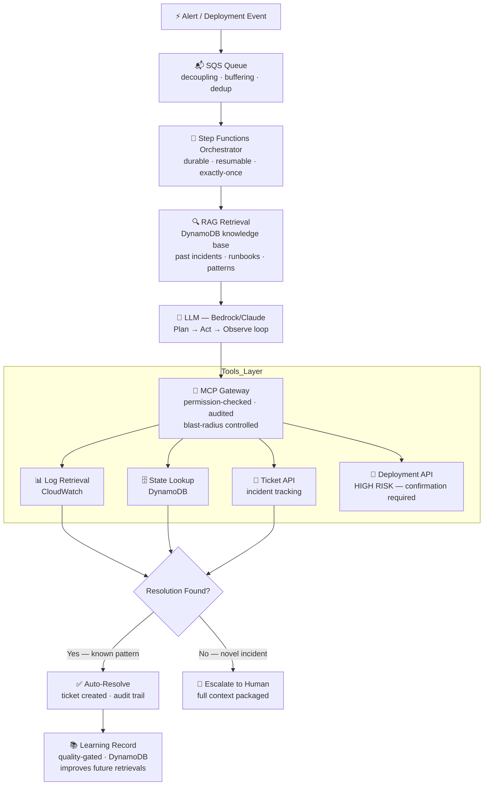
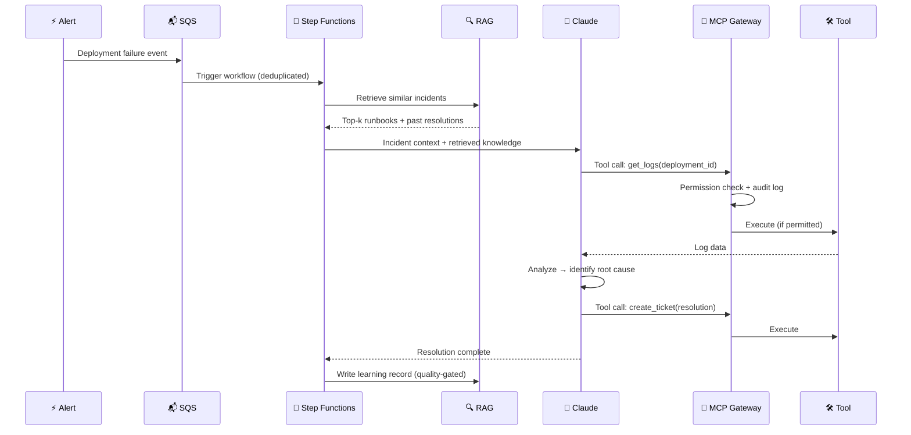

# agentic-ops

> I built a production AI agent that eliminated the majority of manual oncall triage on a large-scale CI/CD and data platform. This repo is the 8 principles that made it safe to run unattended, each backed by a small, real, runnable example in [`examples/`](examples/).

---

## The Problem

The platform this agent runs on serves a large number of internal teams whose end-customer experience depends directly on deployment reliability. On top of ongoing production deployments, the platform also runs a large-scale data migration.

Running oncall at this scale means a steady stream of deployment failure tickets every week — each requiring the same investigation cycle:

1. Deployment fails → alert fires (could be routine CI/CD or migration pipeline)
2. Engineer wakes up, correlates logs across 4-5 systems
3. Finds the known failure pattern across a 9-step deployment pipeline — 25+ distinct failure signatures mapped to root causes
4. Applies the fix
5. Documents it in a ticket
6. Goes back to sleep

**None of that required human judgment.** It required access to systems, pattern recognition, and execution of a known remediation — at a platform that never sleeps because it serves a large customer base across time zones.

The goal: build an agent that handles the full triage loop autonomously — from alert to resolution — while maintaining complete auditability and safe fallback to human escalation.

| | |
|---|---|
| **Problem** | Oncall for a large-scale platform means the same triage loop — alert → logs → pattern → fix → document — repeated many times a week. |
| **Solution** | An agentic system that handles the full loop autonomously: governed tool access, durable execution, knowledge retrieval, and safe escalation when genuinely novel. |
| **Impact** | Strong voluntary adoption, a significant reduction in manual triage time, zero production incidents caused by the agent. |

---

## The 8 Principles

Each principle below is the answer to a specific way this system failed, or could have failed, in production. Each links to a runnable file in [`examples/`](examples/) that demonstrates the pattern in isolation — no AWS account or credentials needed to run any of them.

### 1. Durable execution beats a custom retry loop

A plain `while` loop in a worker process loses all progress on a crash or restart. Lambda alone also caps execution at 15 minutes — too short for a workflow that's waiting on a deployment to finish retrying. The orchestration layer has to survive failures independently of the business logic running inside it.

**In production:** AWS Step Functions. The non-AWS equivalent is Temporal — same concept, different vendor.
**Tradeoff:** per-state-transition cost. Fine at this scale; re-evaluate for very high-frequency workflows.
**Example:** [`examples/01_durable_execution.py`](examples/01_durable_execution.py) — checkpoints progress after every step so a crash resumes where it left off, not from zero.

### 2. Every tool call goes through a governed gateway, not a direct API call

An LLM with direct API access is how you get a production incident caused by the agent itself. There has to be an enforcement point between "the model decided to do X" and "X actually happened" — one that checks permissions and risk level *before* execution, not one that hopes the prompt was followed.

**In production:** an MCP gateway. Every tool is registered with a required permission and a risk tier (LOW/MEDIUM/HIGH); HIGH-risk tools require explicit confirmation. Every call, permitted or denied, is written to an immutable audit trail.
**Key insight:** don't give the agent the keys to the kingdom — define the minimal tool set per workflow and enforce it at the infrastructure layer, not the prompt.
**Example:** [`examples/02_governed_tool_gateway.py`](examples/02_governed_tool_gateway.py) — a gateway that checks permission and risk tier before running a tool, and logs every attempt either way.

### 3. Route by workflow shape, not through a single generic pipeline

Batch triage (many known-pattern incidents, speed matters) and deep investigation (one novel incident, accuracy matters) have opposite requirements. Building one system for both optimizes for neither — batch needs fast/cheap/consistent, deep investigation needs thorough/flexible/expensive.

**In production:** incidents are routed up front to one of three configurations — event-driven triage (< 5 min target), batch analysis (throughput-focused), or proactive health checks (compute-sensitive) — each with its own model size, timeout, and tool budget.
**Example:** [`examples/03_workflow_router.py`](examples/03_workflow_router.py) — picks a batch or deep-investigation config based on whether the incident matches a known pattern and how deep the queue is.

### 4. Pick storage for your data shape, not by default

The instinct with a knowledge base is to reach for a vector database. But incident runbooks are structured — `incident_type → resolution steps` — and an exact-match key lookup is faster and simpler than semantic search for that shape of data. Semantic search earns its place as a *fallback*, not the primary path.

**In production:** DynamoDB, single-table design, composite keys (`PK=incident_type#PATTERN`). ~80% of retrievals are exact-match; a lightweight embedding layer handles the rest.
**When to reach for a vector DB instead:** unstructured knowledge (free-form docs, chat history) where semantic similarity *is* the primary retrieval mechanism.
**Example:** [`examples/04_structured_knowledge_lookup.py`](examples/04_structured_knowledge_lookup.py) — exact-match lookup first, semantic fallback only on a miss.

### 5. Decouple ingestion from processing

A cascade of correlated failures — one root cause, many downstream alerts — should not spawn one workflow execution per alert. Without a buffer, 50 simultaneous deployment failures spawn 50 concurrent executions competing for the same fix.

**In production:** an SQS queue in front of the orchestration trigger, with a deduplication window and a dead-letter queue for events that fail to process.
**Example:** [`examples/05_decoupled_ingestion.py`](examples/05_decoupled_ingestion.py) — buffers a burst of events and drops duplicates within a time window before anything downstream runs.

### 6. Gate the learning loop on confirmed outcomes

The self-improvement loop — write a "learning record" after every resolved incident, retrieve it on the next similar one — only works if bad resolutions don't get written into the knowledge base. **What I got wrong the first time:** I stored raw agent outputs as learnings, so false-positive resolutions became part of the knowledge the agent relied on.

**The fix:** a quality gate. A learning record only becomes retrievable after a human confirms the resolution was correct, or after a no-recurrence window passes with no correction. Rejected resolutions are flagged and excluded from retrieval.
**Example:** [`examples/06_quality_gated_learning.py`](examples/06_quality_gated_learning.py) — only confirmed records are retrievable; rejected ones are filtered out permanently.

### 7. Make unsafe actions structurally unavailable, not just discouraged

Telling a model "be careful with rollbacks" in a system prompt is not a control — a confidently wrong model just ignores it. Some actions should be impossible for the agent to take on its own, full stop:

- Any production database mutation — always escalates
- Rollbacks affecting more than one deployment — requires explicit confirmation
- Any action on a system the agent hasn't seen before — escalates with full context

**Why this matters:** a well-designed agentic system isn't about trusting the LLM to make the right call — it's about designing the failure mode to be safe and recoverable regardless of what the LLM decides.
**Example:** [`examples/07_blast_radius_guard.py`](examples/07_blast_radius_guard.py) — raises before executing a rollback that exceeds a resource budget, unless the caller explicitly confirms.

### 8. Instrument three signal types from day one, not after incidents force it

Operational metrics (duration, tool call count) tell you if the system is running. Agent-quality metrics (resolution rate, false-positive rate) tell you if the agent is behaving well. Business metrics (manual time saved) tell you if any of this matters. Shipping only the first type is how a team gets paged by a "healthy" agent that's quietly wrong.

**In production:** all three flow into CloudWatch with SLOs on resolution rate (target >75%) and false-positive rate (target <5%).
**Example:** [`examples/08_observability_signals.py`](examples/08_observability_signals.py) — aggregates all three signal types from a batch of workflow outcomes.

---

## System Design

## Data Flow

---

## Layer Breakdown

| Layer | Technology | Problem It Solves |
|-------|-----------|------------------|
| **Event Ingestion** | SQS | Decouples alert producers from triage. Buffers alert storms. Deduplicates related failures. |
| **Orchestration** | Step Functions | Durable execution survives Lambda restarts. Built-in retry, state history, dead-letter queues. |
| **Intelligence** | Bedrock (Claude) | Plan→Act→Observe loop. Reasons across tool outputs to identify root cause. |
| **Tool Access** | MCP Gateway | Every tool call permission-checked, blast-radius controlled, and audit-logged before execution. |
| **Knowledge** | DynamoDB + embeddings | Sub-ms retrieval of past incidents and runbooks. Self-improving via quality-gated learning records. |
| **Compute** | Lambda | Serverless — scales to zero, per-invocation billing, no idle capacity cost. |
| **Infrastructure** | CDK (TypeScript) | Type-safe IaC. Version-controlled infrastructure. Multi-environment promotion with rollback gates. |
| **Observability** | CloudWatch | Resolution rate SLO, false positive rate, tool permission denial rate, MTTR delta. |

---

## Multi-Orchestrator Architecture

A production agentic ops platform rarely runs on a single orchestrator. The platform this is based on uses two:

| Orchestrator | Used For | Why |
|-------------|---------|-----|
| **AWS Step Functions** | Event-driven CI/CD deployments, rollbacks, agent triage workflows | Durable execution, exactly-once, survives Lambda restarts, native AWS integration |
| **Apache Airflow** | Scheduled batch jobs — cache refresh, snapshot creation, data sync, migration DAGs | Cron-based scheduling, DAG dependencies, data pipeline backfill support |

**The handoff pattern:** Airflow DAGs trigger Step Functions executions for any work that requires durable, auditable, long-running orchestration. Airflow owns scheduling; Step Functions owns execution state.

---

## Rate Limiting & Security in Pipeline Design

Three rate limits you must design for explicitly:

| Limit | Source | How to handle |
|-------|--------|--------------|
| **LLM tokens/min** | Provider quota | Token bucket in gateway; shed load to smaller model or queue |
| **Tool call frequency** | Your downstream APIs | Per-caller rate limit in MCP server; back-pressure via SQS visibility timeout |
| **Step Functions transitions** | AWS service quota | Design state machines to minimize transitions; use `Pass` states sparingly |

**The most common mistake:** designing for average load. Agentic systems have bursty traffic — a CI pipeline with 50 parallel builds can trigger 50 concurrent workflows at the same second. SQS queue depth is your safety valve; always set a concurrency limit on the Lambda trigger.

**Data boundaries at queue boundaries:** SQS message bodies should contain identifiers (`deployment_id`, `incident_id`), not raw data. The workflow fetches actual data using those identifiers — this keeps sensitive data out of SQS message history and audit trails.

---

## Security & Compliance Design

| Principle | How It's Implemented |
|-----------|---------------------|
| **Least privilege** | Each agent identity holds only the permissions needed for its specific workflow. |
| **Defense in depth** | Three independent layers before any tool executes: permission check → blast-radius guard → input validation. |
| **Fail closed** | Unknown tool, missing permission, or invalid input → exception, never a silent lower-security fallback. |
| **Immutable audit trail** | Every action logged with caller identity, arguments, result, timestamp. Append-only. |
| **Human-in-the-loop for HIGH risk** | Rollbacks and destructive operations always require human confirmation. |

| Standard | Relevant Controls |
|----------|-----------------|
| **SOC 2 Type II** | Complete audit trail of every privileged action, access control enforcement |
| **ISO 27001** | Least privilege, audit logging, incident response documentation |
| **NIST AI RMF** | Risk classification per tool (LOW/MEDIUM/HIGH), human oversight for consequential actions |
| **GDPR / CCPA** | No PII logged in tool arguments; outputs truncated in audit trail |

---

## Scaling: What Changes at 10×

| Component | 1× | 10× | What to change |
|-----------|------------|--------------|----------------|
| **Lambda / Step Functions** | Comfortable | Scales automatically | No change |
| **SQS** | Default concurrency fine | Tune Lambda concurrency limit | Set `ReservedConcurrentExecutions` per workflow type |
| **DynamoDB** | On-demand mode OK | Hot partition risk on high-write patterns | Consider DAX cache; partition key design review |
| **Bedrock/LLM tokens** | Modest spend | 10x spend without mitigation | **Semantic cache becomes mandatory** — meaningful token savings |
| **Knowledge base** | Single-table DynamoDB fine | Evaluate OpenSearch | Migrate to vector search past ~10K documents |

**The single most important 10× preparation:** semantic caching at the LLM gateway layer, before anything else.
**The component that surprises people:** DynamoDB hot partition risk — if one incident type dominates traffic and `PK = incident_type`, all reads land on one partition. Composite keys (`PK = incident_type#shard`) distribute the load.

---

## Results

In production protecting a large-scale platform:

| Metric | Before | After |
|--------|--------|-------|
| Weekly oncall triage time | Hours | Minutes |
| SLA first-contact compliance | Inconsistent | Consistent |
| Time per standard ticket | Tens of minutes | A few minutes (agent-assisted) |
| Error patterns documented | Tribal knowledge only | Growing, classified knowledge base |

- **Strong voluntary adoption** among oncall engineers
- **Zero production incidents** caused by the agent — shipped in read-only observation mode first, autonomous actions only after classification accuracy was confirmed at a high bar
- **Zero recurrence** on patterns added to knowledge base after initial detection
- Multiple platform issues root-caused and escalated; a production regression caught same-day

The incidents that still escalate to a human are genuinely novel — the ones that *should* require human judgment.

---

## What I'd Do Differently

1. **Start with read-only tools.** The first version had write access from day one. A "shadow mode" — agent observes and recommends, human executes — would have built confidence in the agent's judgment before granting execution authority.
2. **Invest in evaluation earlier.** The eval framework was built in month 3; it should have been week 1. See [agent-eval-framework](https://github.com/TushGoel/agent-eval-framework) for the pattern used now.
3. **Explicit blast-radius budgets per workflow.** Some workflows can safely touch 5 resources, others should touch 1 — that should be per-workflow config, not a global policy.

---

## Cost Analysis

Infrastructure cost to protect a large-scale platform is dominated by LLM calls, not compute:

| Service | Relative Monthly Cost |
|---------|-------------|
| Lambda + Step Functions + DynamoDB + SQS | Low, combined |
| **Bedrock/Claude (LLM calls, with semantic cache)** | **Dominant cost driver** |

**LLM cost optimization levers, in order of impact:**
- Semantic cache (biggest lever by far)
- Smaller model for known-pattern matching; large model reserved for novel incidents
- RAG-first: retrieve the answer before calling the LLM when the pattern is already known

**The real ROI isn't engineer hours saved.** It's SLA protection at scale — every hour of faster resolution is an hour of better customer experience.

---

## FAQ

**Q: What if the agent makes a wrong decision?**
Every action is logged with full context. The blast-radius guard prevents any single action from exceeding its configured scope. High-risk operations always require human confirmation.

**Q: How do you handle incidents the agent hasn't seen before?**
It escalates with a pre-packaged context bundle: relevant logs, deployment state, similar past incidents, and its own analysis — everything a human needs in one place.

**Q: How do you roll back the agent if something goes wrong?**
A kill switch disables the SQS trigger. In-flight workflows complete safely; new incidents route to human oncall until re-enabled.

**Q: How does the knowledge base stay accurate?**
See [Principle 6](#6-gate-the-learning-loop-on-confirmed-outcomes) — learning records are quality-gated before they're retrievable.

---

## Related Projects

- **[production-mcp-server](https://github.com/TushGoel/production-mcp-server)** — Reference implementation of the MCP gateway from Principle 2: permission enforcement and audit trails
- **[agent-eval-framework](https://github.com/TushGoel/agent-eval-framework)** — The evaluation framework used to measure and regression-test agent quality
- **[rag-patterns](https://github.com/TushGoel/rag-patterns)** — Production RAG patterns behind the knowledge retrieval in Principle 4

---

## Tech Stack

| Layer | Technology | Why |
|-------|-----------|-----|
| Orchestration | AWS Step Functions | Durable execution, built-in retry, state history |
| LLM | Bedrock (Claude) | Data residency, no data leaving VPC |
| Tool access | MCP | Governed, auditable, permission-enforced |
| Knowledge base | DynamoDB + embeddings | Structured operational data, sub-ms reads |
| Event ingestion | SQS | Decoupling, buffering, deduplication |
| Compute | Lambda | Serverless, scales to zero, per-invocation billing |
| IaC | CDK (TypeScript) | Type-safe infrastructure, version-controlled |
| Observability | CloudWatch | Native AWS integration, custom metrics, SLOs |

---

## License

MIT

---

## Part of the Agentic Infrastructure Stack

| Repo | What It Is |
|------|-----------|
| **[agentic-ops](https://github.com/TushGoel/agentic-ops)** | ← You are here: 8 production principles, each with a runnable example |
| **[production-mcp-server](https://github.com/TushGoel/production-mcp-server)** | Reference implementation of the MCP governance layer with 12 passing tests |
| **[agent-eval-framework](https://github.com/TushGoel/agent-eval-framework)** | The evaluation framework used to measure and regression-test agent quality |
| **[rag-patterns](https://github.com/TushGoel/rag-patterns)** | Production RAG patterns — retrieval, evaluation, self-correction |
